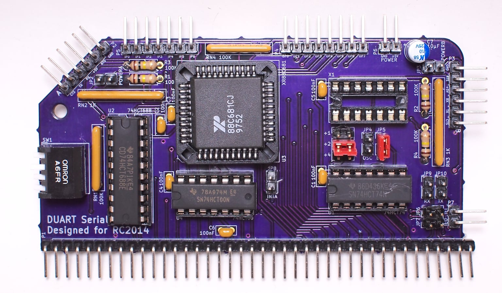

# DUART Dual Serial Board Designed For RC2014

This is an XR88C681-based serial interface card designed for the RC2014 microcomputer system. This provides two serial interfaces to an RC2014 system in addition to a 16-bit counter/timer and several general-purpose input and output lines.

The board has undergone limited testing with the [SCM](https://smallcomputercentral.wordpress.com/small-computer-monitor/small-computer-monitor-v1-0/) driver written by Colin MacArthur for Tadeusz Pycio's [XR88C681 board](https://groups.google.com/forum/#!topic/retro-comp/5gGqL3yGzyA) (and it should be fully software compatible with it).

A driver has been incorporated into the dev branch of [RomWBW](https://github.com/wwarthen/RomWBW). This is not currently built into the standard RC2014 ROM but is available in the RCZ80_duart configuration.

## Build Notes

Until this is properly documented, refer to the [schematic](duart.pdf).

The values and types of most components are not critical. Capacitors C1-C6 (100nF, MLCC) are power bypass/decoupling capacitors for each IC and C7 (10µF, electrolytic) provides additional transient decoupling for the DUART itself. RN1 and RN4 (100kΩ) are bussed resistor networks intended to act as pull-ups for the chip select logic (RN1) and to prevent the general purpose inputs (and IM2-specific interrupt lines) from floating (RN4). RN2 and RN3 (1kΩ) are isolated resistor networks intended to provide short-circuit protection to the serial I/O lines. R1 and R2 (100kΩ) pull the serial receive input lines up to their idle state. R3 and R4 (100kΩ) pull the serial /CTS input lines down to their active state.

Oscillator X1 and capacitor C5 are optional in a standard RC2014 system with a 7.3728MHz clock. In this case JP5 should be closed and pins 3 and 4 (CLKDIV2) of JP1 should be bridged with jumpers to provided the DUART with its expected 3.6864MHz clock.

## License

Copyright 2019-2020 Chris Odorjan

This work is licensed under a [Creative Commons Attribution-ShareAlike 4.0 International License](http://creativecommons.org/licenses/by-sa/4.0/).
